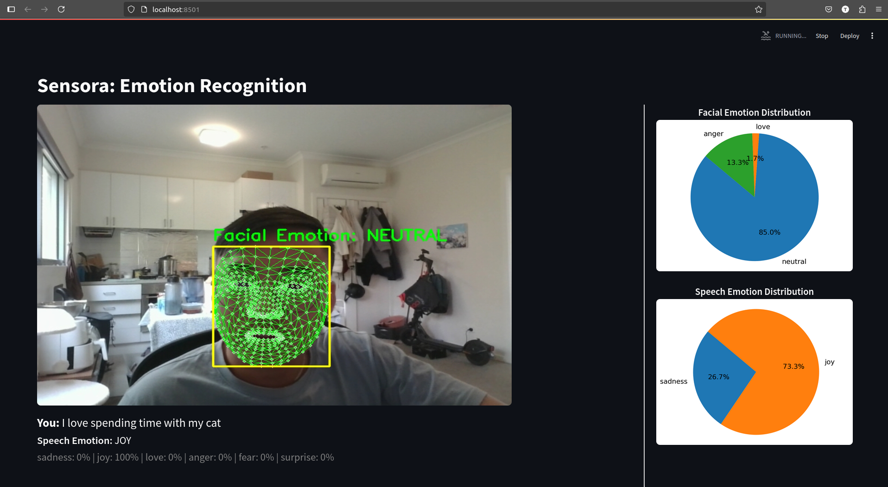

# Sensora
Sensora is a real-time emotion recognition system that combines facial expressions and speech to detect six core emotions. Using facial landmarks and audio analysis, it delivers fast, intuitive insights, built for deployment in web or cloud environments.

