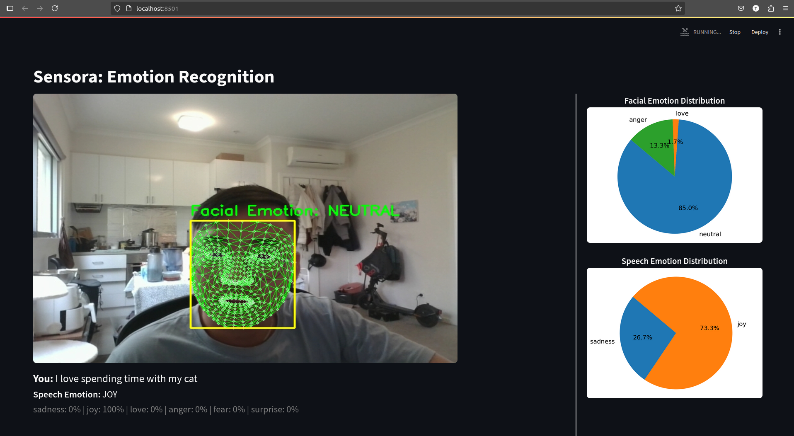

# Sensora

**Sensora** is a real-time emotion recognition system that analyzes both facial expressions and speech to classify six core emotions. It leverages facial landmarks and audio input to deliver accurate, intuitive insights in real time.

Designed for flexible deployment, Sensora runs seamlessly in local or cloud-based environments and is ideal for applications in human-computer interaction, accessibility, and behavioral analysis.

